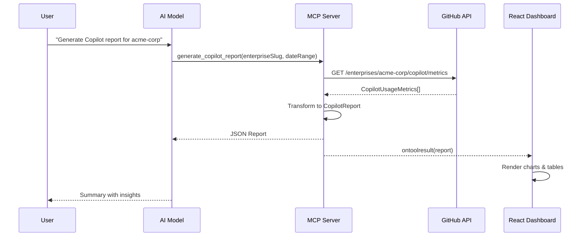

<p align="center">
  <picture>
    <source media="(prefers-color-scheme: dark)" srcset="assets/icon.svg">
    <source media="(prefers-color-scheme: light)" srcset="assets/icon.svg">
    
  </picture>
</p>

<h1 align="center">Copilot Compass</h1>

<p align="center">
  <strong>Navigate your GitHub Copilot adoption with actionable insights</strong>
</p>

<p align="center">
  An MCP App that delivers comprehensive GitHub Copilot usage analytics through an interactive React dashboard, powered by the <a href="https://github.com/modelcontextprotocol/ext-apps">MCP Apps SDK</a>.
</p>

<p align="center">
  <a href="#features">Features</a> •
  <a href="#quick-start">Quick Start</a> •
  <a href="#architecture">Architecture</a> •
  <a href="#mcp-integration">MCP Integration</a> •
  <a href="#configuration">Configuration</a>
</p>

---

## Overview

**Copilot Compass** is a Model Context Protocol (MCP) application that transforms raw GitHub Copilot metrics into actionable intelligence. Built with the MCP Apps SDK, it provides both AI-readable data and an interactive visual dashboard that renders directly in MCP-compatible hosts like VS Code and Claude Desktop.

### What Makes This Special?

Unlike traditional dashboards, Copilot Compass leverages the **MCP Apps SDK** pattern:

- **AI-First**: Tools return structured data that AI models can analyze and summarize
- **Visual Dashboard**: The same tool invocation renders an interactive React UI in the host
- **Real-Time Sync**: UI automatically updates when new data arrives via `ontoolresult`
- **Host Theming**: Dashboard adapts to the host's color scheme via `useHostStyles`

## Features

### Analytics Dashboard
- **Active Users Trend** — 14-day line chart with daily active user counts
- **Acceptance Rate** — Track code suggestion acceptance over time
- **Language Breakdown** — Top languages by suggestions, acceptances, and engaged users
- **Editor Distribution** — Usage split across VS Code, JetBrains, Neovim, and more
- **Chat Metrics** — Sessions, code insertions, and copy events from Copilot Chat
- **PR Intelligence** — Pull request summary generation statistics

### Report Generation
- **Enterprise & Organization Support** — Fetch metrics at enterprise or org level
- **Flexible Date Ranges** — Analyze any time period
- **Automatic Fallback** — Demo mode with realistic mock data when API unavailable
- **Caching Layer** — 5-minute TTL reduces API calls and improves response times

### MCP Apps SDK Features
- **Tool + UI Binding** — `_meta.ui.resourceUri` links tools to their visual representation
- **App-Only Tools** — `visibility: ["app"]` for UI-initiated actions hidden from AI
- **Host Context** — Safe area insets and theme integration
- **Lifecycle Hooks** — `ontoolresult`, `ontoolinput`, `onteardown` callbacks

## Quick Start

### Prerequisites

- **Node.js** 18+ 
- **GitHub PAT** with scopes:
  - `manage_billing:copilot` — Access Copilot metrics
  - `read:enterprise` — Enterprise-level access
  - `read:org` — Organization metrics

### Installation

```bash
# Clone the repository
git clone https://github.com/samueltauil/copilot-compass.git
cd copilot-compass

# Install dependencies
npm install

# Configure environment
cp .env.example .env
# Edit .env and add your GITHUB_TOKEN
```

### Build & Run

```bash
# Build the React dashboard and TypeScript server
npm run build

# Start the MCP server
npm start
```

The server starts at `http://localhost:3001` with:
- **MCP Endpoint**: `http://localhost:3001/mcp`
- **Health Check**: `http://localhost:3001/health`

### Connect Your MCP Client

Add to your MCP client configuration (e.g., Claude Desktop, VS Code):

```json
{
  "mcpServers": {
    "copilot-compass": {
      "url": "http://localhost:3001/mcp"
    }
  }
}
```

## Architecture


### Data Flow



## MCP Integration

### Tools

#### `generate_copilot_report`

Generate a comprehensive Copilot usage report with interactive dashboard.

| Parameter | Type | Required | Description |
|-----------|------|----------|-------------|
| `enterpriseSlug` | string | Yes | Enterprise identifier |
| `orgName` | string | No | Organization within enterprise |
| `dateRange.from` | string | Yes | Start date (YYYY-MM-DD) |
| `dateRange.to` | string | Yes | End date (YYYY-MM-DD) |

**Example prompt:**
```text
Generate a Copilot report for enterprise "acme-corp" from 2024-01-01 to 2024-01-31
```

#### `refresh_report` (App-Only)

Same parameters as above, but with `visibility: ["app"]` — hidden from AI, invocable only by the UI for refresh actions.

### Resources

| URI | Description |
|-----|-------------|
| `ui://copilot-metrics/mcp-app.html` | Interactive React dashboard |

## Project Structure

```text
copilot-compass/
├── server.ts                    # MCP server entry (tools + resources)
├── src/
│   ├── types.ts                 # TypeScript interfaces
│   ├── github-client.ts         # GitHub API client with caching
│   ├── report-generator.ts      # Report generation + mock data
│   ├── html-report-generator.ts # Standalone HTML export
│   ├── svg-charts.ts            # Inline SVG for markdown
│   ├── visual-report-generator.ts # Markdown report with charts
│   ├── mcp-app.tsx              # React dashboard entry
│   └── global.css               # Dashboard styles
├── mcp-app.html                 # Vite entry point
├── assets/
│   └── icon.svg                 # Compass icon
├── dist/                        # Build output
├── vite.config.ts               # Vite config (singlefile plugin)
├── tsconfig.json                # TypeScript config (React)
└── tsconfig.server.json         # TypeScript config (Node.js)
```

## Configuration

### Environment Variables

| Variable | Description | Default |
|----------|-------------|---------|
| `GITHUB_TOKEN` | GitHub PAT with Copilot metrics access | — |
| `PORT` | Server port | `3001` |
| `MCP_SERVER_PORT` | Alternative port variable | `3001` |
| `CACHE_TTL_SECONDS` | API response cache duration | `300` |

### GitHub Token Scopes

| Scope | Purpose |
|-------|---------|
| `manage_billing:copilot` | Required for metrics access |
| `read:enterprise` | Enterprise-level queries |
| `read:org` | Organization-level queries |

## Development

```bash
# Watch mode for UI development
npm run dev

# Build for production
npm run build

# Run server (requires build first)
npm start

# Type checking
npx tsc --noEmit
```

## Tech Stack

- **Runtime**: Node.js 18+ with native ES modules
- **Framework**: MCP Apps SDK (`@modelcontextprotocol/ext-apps`)
- **UI**: React 19 + Chart.js 4 + react-chartjs-2
- **Build**: Vite 6 + vite-plugin-singlefile (bundles to one HTML)
- **Transport**: Streamable HTTP (stateless mode)
- **Validation**: Zod schemas for tool inputs

## Contributing

1. Fork the repository
2. Create a feature branch (`git checkout -b feature/amazing-feature`)
3. Commit your changes (`git commit -m 'Add amazing feature'`)
4. Push to the branch (`git push origin feature/amazing-feature`)
5. Open a Pull Request

## License

MIT - [Samuel Tauil](https://github.com/samueltauil)

---

<p align="center">
  Built with the <a href="https://github.com/modelcontextprotocol/ext-apps">MCP Apps SDK</a>
</p>
