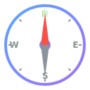
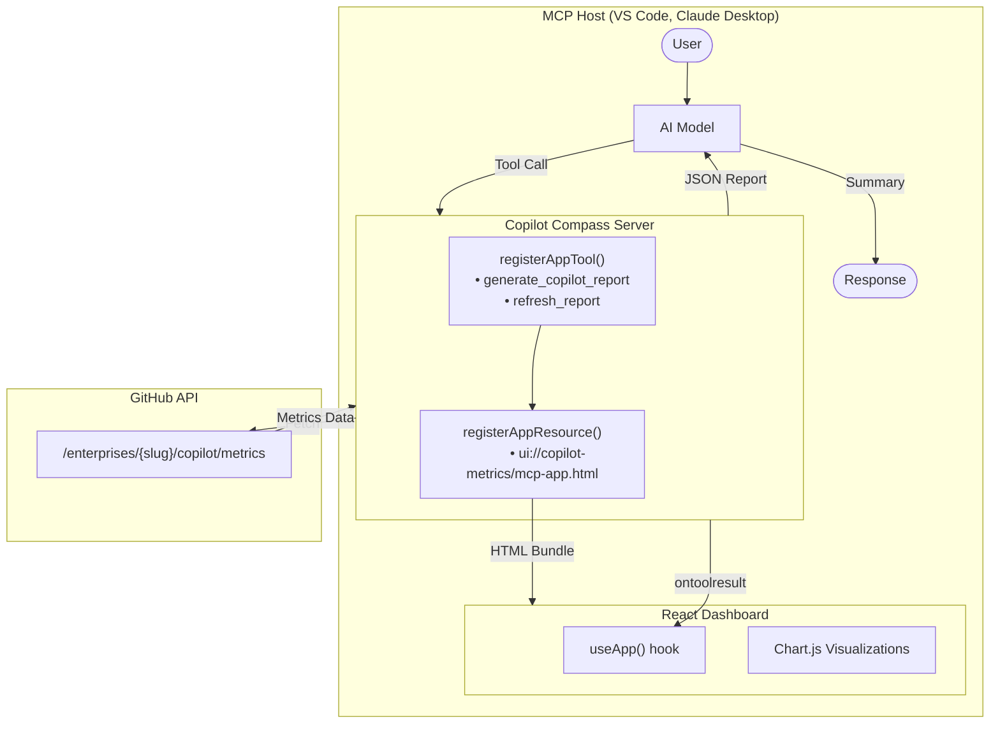
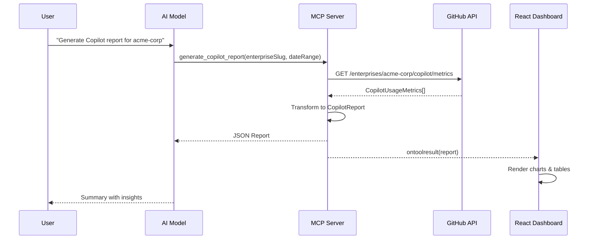

<p align="center">
  <picture>
    <source media="(prefers-color-scheme: dark)" srcset="assets/icon.svg">
    <source media="(prefers-color-scheme: light)" srcset="assets/icon.svg">
    
  </picture>
</p>

<h1 align="center">Copilot Compass</h1>

<p align="center">
  <strong>Navigate your GitHub Copilot adoption with actionable insights</strong>
</p>

<p align="center">
  <a href="https://nodejs.org/"></a>
  <a href="https://www.typescriptlang.org/"></a>
  <a href="https://react.dev/"></a>
  <a href="https://modelcontextprotocol.io/"></a>
  <a href="LICENSE"></a>
</p>

<p align="center">
  An MCP App that delivers comprehensive GitHub Copilot usage analytics through an interactive React dashboard, powered by the <a href="https://github.com/modelcontextprotocol/ext-apps">MCP Apps SDK</a>.
</p>

<p align="center">
  <a href="#features">Features</a> •
  <a href="#quick-start">Quick Start</a> •
  <a href="#usage-examples">Usage</a> •
  <a href="#architecture">Architecture</a> •
  <a href="#mcp-integration">MCP Integration</a> •
  <a href="#troubleshooting">Troubleshooting</a>
</p>

---

## Overview

**Copilot Compass** is a Model Context Protocol (MCP) application that transforms raw GitHub Copilot metrics into actionable intelligence. Built with the MCP Apps SDK, it provides both AI-readable data and an interactive visual dashboard that renders directly in MCP-compatible hosts like VS Code and Claude Desktop.

### What Makes This Special?

Unlike traditional dashboards, Copilot Compass leverages the **MCP Apps SDK** pattern:

- **AI-First**: Tools return structured data that AI models can analyze and summarize
- **Visual Dashboard**: The same tool invocation renders an interactive React UI in the host
- **Real-Time Sync**: UI automatically updates when new data arrives via `ontoolresult`
- **Host Theming**: Dashboard adapts to the host's color scheme via `useHostStyles`

## Features

### Analytics Dashboard
- **Active Users Trend** — 14-day line chart with daily active user counts
- **Acceptance Rate** — Track code suggestion acceptance over time
- **Language Breakdown** — Top languages by suggestions, acceptances, and engaged users
- **Editor Distribution** — Usage split across VS Code, JetBrains, Neovim, and more
- **Chat Metrics** — Sessions, code insertions, and copy events from Copilot Chat
- **PR Intelligence** — Pull request summary generation statistics

### Understanding the Metrics

| Metric | What It Measures | Why It Matters |
|--------|------------------|----------------|
| **Active Users** | Unique users who received Copilot suggestions | Adoption breadth |
| **Engaged Users** | Users who accepted at least one suggestion | Active value extraction |
| **Acceptance Rate** | Accepted suggestions ÷ total suggestions | Quality of suggestions |
| **Lines Accepted** | Actual code lines integrated from Copilot | Productivity impact |
| **Chat Sessions** | Copilot Chat conversations initiated | AI pair programming usage |
| **Code Insertions** | Chat-generated code added to files | Conversational coding value |
| **PR Summaries** | Pull request descriptions auto-generated | Review process efficiency |

### Report Generation
- **Enterprise & Organization Support** — Fetch metrics at enterprise or org level
- **Flexible Date Ranges** — Analyze any time period
- **Automatic Fallback** — Demo mode with realistic mock data when API unavailable
- **Caching Layer** — 5-minute TTL reduces API calls and improves response times

### MCP Apps SDK Features
- **Tool + UI Binding** — `_meta.ui.resourceUri` links tools to their visual representation
- **App-Only Tools** — `visibility: ["app"]` for UI-initiated actions hidden from AI
- **Host Context** — Safe area insets and theme integration
- **Lifecycle Hooks** — `ontoolresult`, `ontoolinput`, `onteardown` callbacks

## Quick Start

### Prerequisites

- **Node.js** 18+ 
- **GitHub PAT** with scopes:
  - `manage_billing:copilot` — Access Copilot metrics
  - `read:enterprise` — Enterprise-level access
  - `read:org` — Organization metrics

### Installation

```bash
# Clone the repository
git clone https://github.com/samueltauil/copilot-compass.git
cd copilot-compass

# Install dependencies
npm install

# Configure environment
cp .env.example .env
# Edit .env and add your GITHUB_TOKEN
```

### Build & Run

```bash
# Build the React dashboard and TypeScript server
npm run build

# Start the MCP server
npm start
```

The server starts at `http://localhost:3001` with:
- **MCP Endpoint**: `http://localhost:3001/mcp`
- **Health Check**: `http://localhost:3001/health`

### Connect Your MCP Client

Add to your MCP client configuration (e.g., Claude Desktop, VS Code):

**For remote HTTP connection:**
```json
{
  "mcpServers": {
    "copilot-compass": {
      "type": "http",
      "url": "http://localhost:3001/mcp"
    }
  }
}
```

**For local stdio connection (alternative):**
```json
{
  "mcpServers": {
    "copilot-compass": {
      "type": "stdio",
      "command": "node",
      "args": ["dist/server.js"],
      "cwd": "/path/to/copilot-compass",
      "env": {
        "GITHUB_TOKEN": "your-github-token"
      }
    }
  }
}
```

## Architecture



### Data Flow



## MCP Integration

### Tools

#### `generate_copilot_report`

Generate a comprehensive Copilot usage report with interactive dashboard.

| Parameter | Type | Required | Description |
|-----------|------|----------|-------------|
| `enterpriseSlug` | string | Yes | Enterprise identifier |
| `orgName` | string | No | Organization within enterprise |
| `dateRange.from` | string | Yes | Start date (YYYY-MM-DD) |
| `dateRange.to` | string | Yes | End date (YYYY-MM-DD) |

**Example prompt:**
```text
Generate a Copilot report for enterprise "acme-corp" from 2024-01-01 to 2024-01-31
```

#### `refresh_report` (App-Only)

Same parameters as above, but with `visibility: ["app"]` — hidden from AI, invocable only by the UI for refresh actions.

### Resources

| URI | Description |
|-----|-------------|
| `ui://copilot-metrics/mcp-app.html` | Interactive React dashboard |

## Usage Examples

Here are some common prompts to get the most out of Copilot Compass:

### Basic Report Generation

```text
Generate a Copilot report for enterprise "acme-corp" from 2024-01-01 to 2024-01-31
```

### Monthly Adoption Analysis

```text
Show me Copilot usage for "my-enterprise" for the last 30 days and highlight adoption trends
```

### Organization-Specific Metrics

```text
Generate a Copilot report for organization "engineering-team" within enterprise "acme-corp" for Q4 2024
```

### Comparing Time Periods

```text
Generate Copilot reports for enterprise "acme-corp" for January and February 2024 and compare the adoption rates
```

### Deep Dive Analysis

```text
Analyze the Copilot report for "acme-corp" and tell me:
1. Which languages have the highest acceptance rates?
2. What's the trend in daily active users?
3. Which editors are most popular?
4. How is Copilot Chat being used?
```

### Dashboard Insights

The AI model can analyze the report data and provide insights like:

- **Adoption Health**: Are active users growing, stable, or declining?
- **Language Hotspots**: Which languages benefit most from Copilot?
- **Feature Usage**: Balance between code completions, chat, and PR summaries
- **Editor Preferences**: Which IDEs your team prefers for Copilot interactions

## Project Structure

```text
copilot-compass/
├── server.ts                    # MCP server entry (tools + resources)
├── src/
│   ├── types.ts                 # TypeScript interfaces
│   ├── github-client.ts         # GitHub API client with caching
│   ├── report-generator.ts      # Report generation + mock data
│   ├── html-report-generator.ts # Standalone HTML export
│   ├── svg-charts.ts            # Inline SVG for markdown
│   ├── visual-report-generator.ts # Markdown report with charts
│   ├── mcp-app.tsx              # React dashboard entry
│   └── global.css               # Dashboard styles
├── mcp-app.html                 # Vite entry point
├── assets/
│   └── icon.svg                 # Compass icon
├── dist/                        # Build output
├── .env.example                 # Sample environment variables
├── vite.config.ts               # Vite config (singlefile plugin)
├── tsconfig.json                # TypeScript config (React)
└── tsconfig.server.json         # TypeScript config (Node.js)
```

## Configuration

Copy the sample environment file and configure your settings:

```bash
cp .env.example .env
```

### Environment Variables

| Variable | Description | Default |
|----------|-------------|---------|
| `GITHUB_TOKEN` | GitHub PAT with Copilot metrics access | — |
| `PORT` | Server port | `3001` |
| `MCP_SERVER_PORT` | Alternative port variable | `3001` |
| `CACHE_TTL_SECONDS` | API response cache duration | `300` |

### GitHub Token Scopes

| Scope | Purpose |
|-------|---------|
| `manage_billing:copilot` | Required for metrics access |
| `read:enterprise` | Enterprise-level queries |
| `read:org` | Organization-level queries |

## Development

```bash
# Watch mode for UI development
npm run dev

# Build for production
npm run build

# Run server (requires build first)
npm start

# Type checking
npx tsc --noEmit
```

## Testing

The project includes a comprehensive test suite using [Vitest](https://vitest.dev/).

### Running Tests

```bash
# Run all tests
npm test

# Run tests in watch mode (re-runs on file changes)
npm run test:watch

# Run tests with coverage report
npm run test:coverage
```

### Test Coverage

| Module | Coverage | Description |
|--------|----------|-------------|
| `github-client.ts` | 98% | API client, caching, error handling |
| `report-generator.ts` | 98% | Report generation, mock data, aggregation |
| `svg-charts.ts` | 100% | SVG chart generation functions |
| `schemas.ts` | 100% | Zod schema validation |

### Test Structure

```text
tests/
├── setup.ts                  # Global test setup and mocks
├── github-client.test.ts     # API client tests (15 tests)
├── report-generator.test.ts  # Report generator tests (18 tests)
├── svg-charts.test.ts        # Chart generation tests (40 tests)
├── integration.test.ts       # End-to-end pipeline tests (37 tests)
└── fixtures/
    └── api-responses.ts      # Realistic GitHub API response fixtures
```

**Total: 110 tests**

### What's Tested

- **GitHub API Client**: Token validation, enterprise/org endpoints, caching behavior, error handling
- **Report Generator**: Live data transformation, mock data fallback, summary aggregation, edge cases
- **SVG Charts**: Bar, line, donut, horizontal bar, and sparkline chart generation
- **Schema Validation**: Zod schema parsing, API response validation, error formatting
- **Integration Pipeline**: End-to-end data flow with realistic fixtures for both enterprise and organization metrics

### API Response Validation

The project uses Zod schemas to validate GitHub API responses at runtime, ensuring data integrity:

```typescript
// Validation is automatic - errors are thrown if API response is malformed
const metrics = await client.getEnterpriseMetrics('my-enterprise', dateRange);
```

Validation can be disabled for performance (not recommended):

```bash
VALIDATE_API_RESPONSES=false npm start
```

## Troubleshooting

### Common Issues

#### "GitHub API error (403): Resource not accessible"

**Cause**: Your GitHub token lacks the required scopes.

**Solution**: Create a new PAT with these scopes:
- `manage_billing:copilot` (required)
- `read:enterprise` for enterprise metrics
- `read:org` for organization metrics

#### "GitHub API error (404): Not Found"

**Cause**: The enterprise slug or organization name doesn't exist, or you don't have access.

**Solution**:
1. Verify the enterprise/org name in GitHub settings
2. Ensure your account has Copilot Business/Enterprise access
3. Check that you're a member of the organization

#### Dashboard shows "Demo Data" / Mock Data

**Cause**: The GitHub API call failed, so the app falls back to demo data.

**Solution**:
1. Check the server logs for API error messages
2. Verify your `GITHUB_TOKEN` environment variable is set
3. Ensure the token has the correct scopes
4. Try a shorter date range (API returns max 28 days per request)

#### Server won't start / Port already in use

**Solution**:
```bash
# Find and kill the process using port 3001
npx kill-port 3001

# Or use a different port
PORT=3002 npm start
```

#### "Tool not found" in MCP client

**Cause**: The MCP client hasn't connected to the server or needs a refresh.

**Solution**:
1. Restart the MCP server
2. Reload/restart your MCP client (VS Code, Claude Desktop)
3. Check the server URL in your MCP configuration

#### TypeScript compilation errors

**Solution**:
```bash
# Clean build artifacts and rebuild
rm -rf dist && npm run build
```

### Debug Mode

Enable verbose logging to diagnose issues:

```bash
DEBUG=* npm start
```

## FAQ

### What GitHub Copilot plans are supported?

Copilot Compass works with:
- **Copilot Business** — Organization-level access
- **Copilot Enterprise** — Enterprise + organization-level access

Individual Copilot Pro subscriptions do not have access to the metrics API.

### How far back can I query data?

The GitHub API returns up to **28 days of data per request**. For longer periods, the app automatically handles pagination. Historical data is available from when Copilot was enabled for your organization.

### Is the API response cached?

Yes, responses are cached for **5 minutes** (configurable via `CACHE_TTL_SECONDS`). This reduces API calls during repeated queries or dashboard refreshes.

### Can I run this without a GitHub token?

Yes, for demos. The app falls back to realistic mock data if no token is provided or the API fails. Look for `dataSource: "mock"` in the report.

### What's the difference between enterprise and organization reports?

- **Enterprise**: Aggregated metrics across ALL organizations in your enterprise
- **Organization**: Metrics for a specific organization only

### How do I interpret acceptance rate?

- **≥40%**: Excellent — Copilot is significantly boosting productivity
- **25-40%**: Good — Developers are finding value in suggestions
- **<25%**: Review — Consider training or language-specific tuning

### Can I export the data?

The JSON report returned by the tool contains all metrics. The AI model can format this into Markdown, CSV, or other formats on request.

### Does this work with GitHub Enterprise Server (GHES)?

Currently, only GitHub Cloud (github.com) is supported. GHES support would require modifying the API base URL.

## Tech Stack

- **Runtime**: Node.js 18+ with native ES modules
- **Framework**: MCP Apps SDK (`@modelcontextprotocol/ext-apps`)
- **UI**: React 19 + Chart.js 4 + react-chartjs-2
- **Build**: Vite 6 + vite-plugin-singlefile (bundles to one HTML)
- **Transport**: Streamable HTTP (stateless mode)
- **Validation**: Zod schemas for tool inputs

## Contributing

1. Fork the repository
2. Create a feature branch (`git checkout -b feature/amazing-feature`)
3. Commit your changes (`git commit -m 'Add amazing feature'`)
4. Push to the branch (`git push origin feature/amazing-feature`)
5. Open a Pull Request

## Related Resources

### GitHub Copilot Documentation
- [Copilot Metrics API Reference](https://docs.github.com/en/rest/copilot/copilot-metrics) — Official API documentation
- [About GitHub Copilot Metrics](https://docs.github.com/en/copilot/rolling-out-github-copilot-at-scale/viewing-copilot-metrics) — Understanding the metrics
- [Copilot Business vs Enterprise](https://docs.github.com/en/copilot/copilot-business/about-github-copilot-business) — Plan comparison

### MCP Resources
- [MCP Apps SDK](https://github.com/modelcontextprotocol/ext-apps) — SDK for building MCP apps with UIs
- [Model Context Protocol](https://modelcontextprotocol.io/) — Protocol specification
- [MCP Servers Repository](https://github.com/modelcontextprotocol/servers) — Community MCP servers

### Technologies Used
- [Chart.js](https://www.chartjs.org/) — Charting library
- [Zod](https://zod.dev/) — TypeScript-first schema validation
- [Vite](https://vitejs.dev/) — Frontend build tool
- [Vitest](https://vitest.dev/) — Unit test framework

## License

MIT - [Samuel Tauil](https://github.com/samueltauil)

---

<p align="center">
  Built with the <a href="https://github.com/modelcontextprotocol/ext-apps">MCP Apps SDK</a>
</p>
